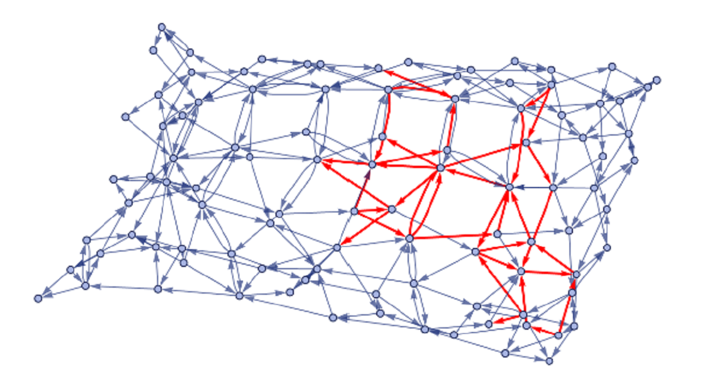

    

<h1 align="center">
  Rules generating elementary particle behavior in the Wolfram Model 
</h1>

My submission from the Wolfram Physics Winter School 2021 which was selected for the editorial column Staff Picks
and earned me a Featured Contributor Badge. [View community post](https://community.wolfram.com/groups/-/m/t/2162975)

## Abstract

Topological obstructions in a hypergraph that are locally stable under the application of rules are candidates for elementary particles in the Wolfram Model. In this project notebook, we create a hypergraph from a planar, triangular tiling, insert a nonplanar hypergraph (K5
or K3,3) as an obstruction, and search for rules in which the obstruction’s effects remained localized using a high-level machine learning-based clustering analysis method. Ultimately, we create an initial framework for generating conditions that exhibit behavior in the Wolfram Model analogous to the motion of an elementary particle in spacetime. There are some promising preliminary results, but much more data needs to be generated in order confirm these results and effectively continue the search for elementary particles. Once a robust framework has been set up for the classification of individual elementary particles, multiple particles should be added to the system to explore analogies to quantum statistics or the dynamics of virtual particles in the quantum foam.

## Version

1.0.0

## Author

Paul Fischer

- Email: paulfischerdev@gmail.com
- Twitter: [@PaulFis43236408](https://twitter.com/PaulFis43236408)
- GitHub: [pfischer1687](https://github.com/pfischer1687)
- Website: [https://paulfischer.dev/](https://paulfischer.dev/)

## Dependencies

- `Mathematica@12.2`

## Keywords

- Wolfram Model
- Topological Obstruction
- Machine Learning
- Clustering Analysis

## License

Unlicensed

## Repository

git: [https://github.com/pfischer1687/wolfram-physics-project](https://github.com/pfischer1687/wolfram-physics-project)

## Bugs

[https://github.com/pfischer1687/wolfram-physics-project/issues](https://github.com/pfischer1687/wolfram-physics-project/issues)
